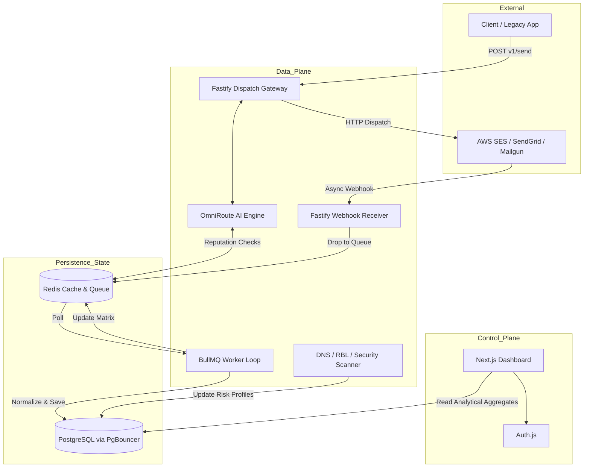
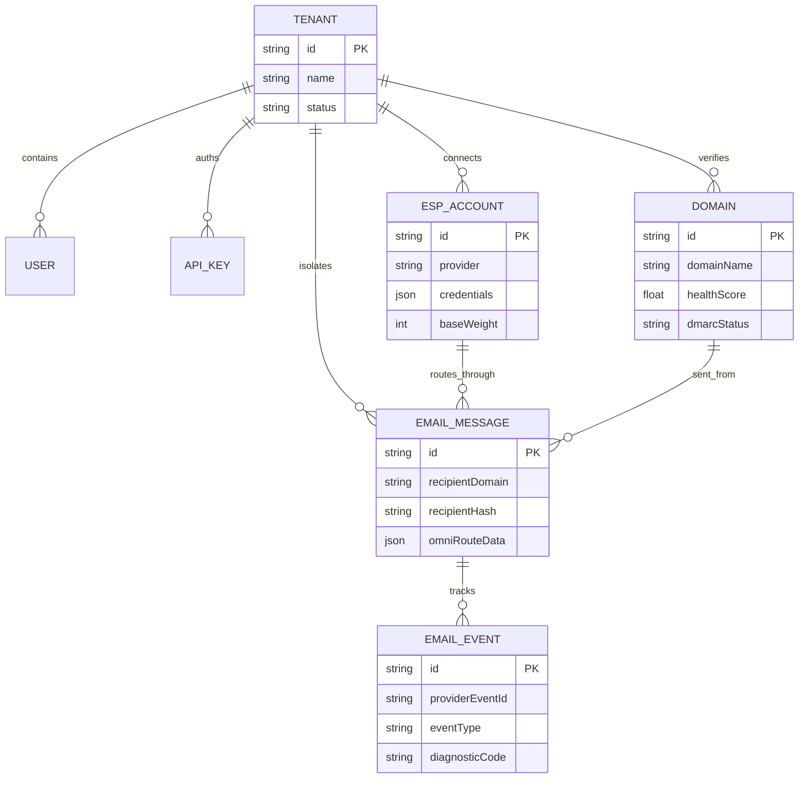

# InboxShield AI - Documentation Review Package

**Date:** 2026-07-21  
**Author:** CTO  

This package serves as a single-source-of-truth summary for senior technical review. It synthesizes the complete 15-document specification suite into an easily digestible format, highlighting architectural decisions, data models, and scaling capabilities.

---

## 1. Complete Project Summary
**InboxShield AI** is an enterprise-grade Email Deliverability Intelligence Platform. It solves the critical risk of single points-of-failure inherent in relying on one Email Service Provider (ESP) like AWS SES or SendGrid. 

By sitting as a middleware gateway between the client and commodity ESPs, InboxShield utilizes **OmniRoute**—a heuristic and LLM-driven AI engine—to dynamically route outbound emails through the infrastructure path with the highest statistical probability of reaching the inbox. It ingests thousands of noisy webhooks from diverse ESPs, normalizes them into a single schema, and provides unified telemetry while constantly scanning physical DNS and RBL infrastructure for reputation degradation.

---

## 2. Final Architecture Diagram



---

## 3. Module Dependency Diagram

```mermaid
graph LR
    subgraph npm_Monorepo
        direction TB
        AppWeb[apps/web : Next.js UI]
        AppWorker[apps/worker : Fastify/BullMQ]
        
        PkgDB[@inboxshield/db : Prisma]
        PkgTypes[@inboxshield/types : Shared DTOs]
        PkgConfig[@inboxshield/config : TS/ESLint]
    end

    AppWeb --> PkgDB
    AppWeb --> PkgTypes
    AppWorker --> PkgDB
    AppWorker --> PkgTypes
    
    PkgDB --> PkgConfig
    AppWeb --> PkgConfig
    AppWorker --> PkgConfig
```

---

## 4. Database ER Diagram



---

## 5. API Overview
All interfaces adhere to strict JSON over HTTPS, OpenAPI 3.1 standards.

- **Outbound Gateway (`POST /v1/emails/send`):** The primary endpoint. Returns synchronous `202 Accepted` < 150ms. Accepts standard MIME properties, attachments, and optional fallback chains.
- **Webhook Ingress (`POST /v1/webhooks/:provider`):** Public-facing, HMAC-secured endpoints for ESPs. Returns immediate `200 OK` to prevent ESP penalty, deferring processing to BullMQ.
- **Management API (`/v1/domains`, `/v1/esps`, `/v1/analytics`):** Secured by tenant-scoped API keys for programmatic workspace management.

---

## 6. Folder Structure
Strict domain separation keeping UI entirely decoupled from Execution.

```text
/inboxshield-ai
├── apps/
│   ├── web/                     # Control Plane (Next.js 15, UI, NextAuth)
│   └── worker/                  # Data Plane (Fastify, BullMQ, OmniRoute AI)
├── packages/
│   ├── db/                      # Shared Prisma schema, migrations, pg-client
│   ├── types/                   # Shared TypeScript interfaces & DTOs
│   ├── eslint-config/           # Monorepo linting standards
│   └── typescript-config/       # Base vs Nextjs strictly typed TSConfigs
└── docs/
    └── formal/                  # 15-stage structured documentation suite
```

---

## 7. Technology Stack
- **Control Plane:** Next.js 15, React 19, Tailwind CSS, shadcn/ui.
- **Data Plane:** Node.js 20+, Fastify, BullMQ.
- **Database:** PostgreSQL (with PgBouncer/Prisma Accelerate).
- **Caching/Queuing:** Redis.
- **ORM:** Prisma.
- **AI/Heuristics:** Native TS algorithms + OpenAI/Anthropic APIs for textual payload checking.
- **Testing:** Vitest, Testcontainers, Playwright, k6.

---

## 8. Risk Assessment
| Risk | Probability | Impact | Mitigation Strategy |
|---|---|---|---|
| **Root ESP Account Ban (Phishing)** | High | Critical | New tenant manual quarantine; AI outbound pre-flight scanning; Auto-Killswitches upon sudden high complaint ratios. |
| **Redis OOM (Out of Memory)** | Med | High | Payload attachments >1MB are streamed direct to S3 and referenced by URL in the queue, preventing binary data from bloating Redis. |
| **PostgreSQL Connection Exhaustion** | High | High | Vercel serverless connections strictly routed through PgBouncer. Node.js workers utilize isolated connection pools. |
| **API Webhook DDoS/Timeouts** | High | Med | Ingress endpoints perform basic HMAC verify and push stringified payload straight to Redis. Zero DB mapping happens synchronously. |

---

## 9. Security Checklist
- [x] All external ESP credentials (API Keys, SMTP passwords) are statically `AES-256-GCM` encrypted at rest using Prisma Middleware.
- [x] Machine validation uses fast `SHA-256` hashing (Tenant API keys).
- [x] RBAC implemented (Admin vs Viewer) preventing lateral tenant modification.
- [x] CSRF/XSS protection handled inherently by NextAuth.js `HttpOnly` sessions.
- [x] GDPR PII Obfuscation worker schedules scrubbing of `EmailMessage.recipient` after 90 days.
- [x] Compound Indexes combined with ESP `providerEventId` enforcing webhook idempotency. 

---

## 10. Performance Strategy
- **Ingestion:** 10,000 requests/minute handled by Fastify routing straight to memory limits.
- **Dispatch:** OmniRoute utilizes an in-memory Redis map mapping `[ESP_ID] -> [ISP]` 24-h success ratios. Eliminates SQL `JOIN`s during synchronous dispatch pipeline.
- **UI Metrics:** Aggregate queries over millions of rows execute against a read-replica or materialized views in Postgres.

---

## 11. Scalability Strategy
- **Dockerized Workers:** Data Plane is entirely stateless. Under heavy queue lag, ECS/Render automatically spins up N+ Node instances to consume jobs faster.
- **Database Partitioning:** `EmailMessage` and `EmailEvent` utilize PostgreSQL declarative partitioning (`PARTITION BY RANGE (createdAt)` split by Month) to keep inserts natively fast and index trees shallow.

---

## 12. Testing Strategy
- **Unit (Vitest):** Core Scanners (DNS, RBL, DMARC) and OmniRoute math fully mocked and tested to 80% coverage.
- **Integration (Testcontainers):** Fastify APIs tested against real instantiated Docker Postgres/Redis instances.
- **E2E (Playwright):** Critical dashboard flows (Account Creation, ESP Integration) mapped via Chromium headless.
- **Performance (k6):** Ensuring Fastify + Redis buffer survives a simulated "Black Friday" barrage of 20k webhooks/min without breaking standard latencies.

---

## 13. Development Phases
- **Phase 1: Foundation (Completed)** Architecture, Documentation, Monorepo initialization.
- **Phase 2: Data Plane** Webhook ingestion, normalization, DB writes.
- **Phase 3: Intelligence** OmniRoute scoring mechanics, Local AI routing.
- **Phase 4: Control Plane** Dashboard, Next.js UI, Data graphing.
- **Phase 5: SaaS Hardening** Warmup engines, Stripe billing, LLM pre-flight payload reviews.

---

## 14. Outstanding Assumptions
1. **Inbound Reply Architecture:** It is assumed clients will configure their MX records to natively support our incoming trap, allowing us to parse replies to calculate authentic delivery ratios.
2. **SMTP Support:** The MVP relies strictly on REST API integrations (`/v1/send`). We assume native legacy SMTP proxying (port 587 handshaking) is pushed to a V2 roadmap constraint.

---

## 15. Future SaaS Roadmap (Years 1 - 3)
1. **Automated Domain Warmups:** Intelligent seed box network to slowly artificially pace sending volumes over 30 days to build raw domain reputation automatically.
2. **Inbox Placement Testing:** Physical integration with hundreds of seed addresses (Gmail, Outlook, Yahoo) to prove to users if their mail is landing in Inbox vs Promotions vs Spam.
3. **Advanced LLM Filtering:** Letting an LLM completely re-write a client's cold email template before sending if it breaches a 70% spam likelihood score.
4. **Click/Open Tracking Pixel Injection:** Native wrapping of HTML bodies with custom analytics pixels to remove dependency on ESP-specific tracking capabilities.
